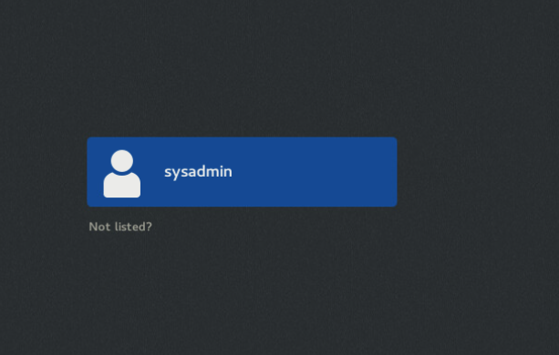
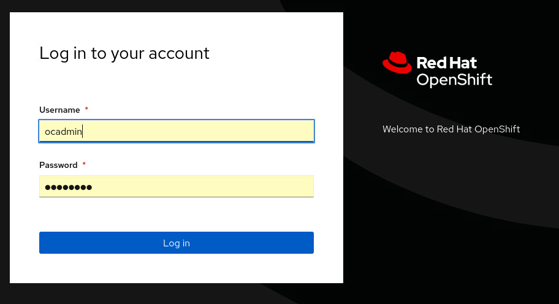

Hands-on Modernization - Go beyond your POC to rapidly deploy and configure your Java applications

This lab provides fundamental hands-on experience with the modernization process for Java Applications. The focus of this lab is on the practical aspects of application deployment and configurations and not the analysis of the Transformation Advisor results. *Other labs cover Transformation Advisor in detail.*

Upon completion of this lab, you will have gained skills to download and use the Transformation Advisor migration bundle to deploy and configure your application:

1.  to a locally running WebSphere - useful for deploying to Liberty in a VM

2.  to a container image – useful for deploying to Kubernetes

3.  using the Liberty Operator – useful for deploying to OpenShift

You will also have explored how to scale these skills from a single application to a real-life enterprise-scale data set.

**IBM Cloud Transformation Advisor** (Transformation Advisor) is an application modernization tool that is entitled through IBM WebSphere Hybrid Edition. Transformation Advisor helps you quickly evaluate on-premises Java EE applications for deployment to the cloud. The Transformation Advisor tool provides the following value:

-   identifies the Java EE programming models in the app

-   determines the complexity of replatforming these apps by listing a high-level inventory of the content and structure of each app

-   Highlights Java EE programming model and WebSphere API differences between the WebSphere runtime profile types

-   identifies Java EE specification implementation differences that might affect the app

-   generates accelerators for deploying the application to Liberty and containers in a target environment

Additionally, the tool provides a recommendation for the right-fit IBM WebSphere Application Server edition and offers advice, best practices, and potential solutions to assess the ease of moving apps to Liberty or newer versions of WebSphere traditional. It accelerates application migrating to cloud process, minimizes errors and risks and reduces time to market.

**1. Introduction**

In this lab, we are considering two different sets of data. The first data set is a single application that is the Proof-of-Concept (PoC) for modernization. We will use this data set to show how to use the Transformation Advisor migration bundle to deploy this application (and configure it) in several different ways.

The second data set is a demo data set provided by IBM, but it is representative of the applications and issues commonly found in all of our enterprise customers’ environments. We will use this second data set to illustrate scaling techniques learned from the first data set on real-life data.

## 2. Objective

The objectives of this lab are to:

-   Learn how to download the application migration bundle and use it to deploy an application to WebSphere Liberty running locally

-   Learn how to fully populate the migration bundle placeholders and build the application into a container image

-   Learn the role of Kustomize when deploying the migration bundle

-   Learn how to deploy your application to OpenShift with a single command

-   Learn how to create multiple configurations for the application and deploy them to OpenShift

-   Review different options for securing secrets

-   Learn how to scale the migration bundle usage across all of the Simple (no code changes required) applications in your estate

## 3. Prerequisites

The following prerequisites must be completed prior to beginning this lab:

-   Familiarity with basic Linux commands

-   Have internet access

-   Access to the TechZone lab environment

## 4. Accessing the lab environment

If you are doing this lab as part of an instructor led workshop (virtual or face-to-face), an environment has already been provisioned for you. The instructor will provide the details for accessing the lab environment.

1.  Access the lab environment from your web browser.

    <https://ui.na.cloud.event.techzone.ibm.com/index.php?env_name=2673&env_type=folder&env_acss=YWRtaW46YWRtaW4>

2.  Click on the **bastion** machine.

1.  The machine will open showing a login prompt

1.  Click on the **sysadmin** icon and enter the following password: **ibmrhocp**

1.  The desktop of the machine will appear

**Tips for working in the lab environment**

1.  You can click “Activities” at any time to get a list of shortcut icons. You will be using the **Firefox browser** and the **terminal** throughout the lab.

1.  You can copy text from your desktop to the lab environment’s **bastion** machine using the **Send Text** option in the tollbar along the top

    

2.  A dialog will open and then you can use **Ctrl+C** to copy your text into the dialog. Then press the **Send Text** button at the bottom to copy the text to the lab environment’s **bastion** machine.

Note: *Occasionally certain characters are removed as part of the send, commonly dot (.) and dash(-). If a command you copy from somewhere else gives an error, try to send it again as an unexpected character may have been removed.*

1.  An alternative to using the **Send Text** option, you may consider opening the lab guide in the web browser inside of the desktop machine. Using this method, you can easily copy / paste text from the lab guide without having to use the **Send Text** option via right-mouse-click Copy and Paste. The lab guide is available here: https://github.com/paulbarr/tx-lab2673/blob/main/README.pdf

2.  This lab uses **podman**. If you are familiar with **docker**, you will see that the commands are the same. This means that everything you learn in this lab can be used with **docker** without any changes.

3.  It may happen that the desktop machine becomes unresponsive in your browser and you cannot interact with it or click on anything. Simply close the browser, go back to the list of lab environment machines and click on the **bastion** machine again. No work will have been lost when it reopens.

4.  The browser homepage has been set to the Transformation Advisor URL. When you first open the browser, it will go these and then prompt you for authentication information. It is as follows:

    -   **Username:** ocadmin

    -   **Password:** ibmrhocp

1.  Several bookmarks have already been added to the browser for your convenience. At various times in the lab, you will be instructed to use them.

## 5. Lab Tasks

In this lab, you will use the Transformation Advisor migration bundle to deploy an application in several different ways and then to apply this knowledge to a real-life enterprise-scale data set.

To simplify the lab and to allow you to focus on the migration bundle, certain software and artifacts have already been put in place for you. These are as follows:

-   Transformation Advisor has been installed and collected data has been loaded

-   A local version of WebSphere Liberty has been installed

-   **podman** (for creating and running images) has been installed

-   The PoC application, built as an image, is available from the OpenShift internal registry (this is to save you having to create and run your own registry)

## 6. Execute Lab Tasks

### 6.1 Pull down the Lab artifacts

There are several different artifacts that you will need to use during this lab. The first step is to clone these down to your machine.

1.  From the **bastion** machine, click the **Terminal** icon to open a **Terminal** window

1.  Create a location for the artifacts and clone the GitHub repo into that location.

mkdir /home/sysadmin/lab

cd /home/sysadmin/lab

git clone https://github.com/paulbarr/tx-lab2673.git

### 6.2 Launch Transformation Advisor

Transformation Advisor has been set as the home page in your browser, so open your browser.

1.  From Workstation VM Desktop Tool Bar click the **Firefox** icon

1.  The browser homepage is set to Transformation Advisor. The first time you open the browser you will be prompted to authenticate against OpenShift. For the username select **ocadmin**

1.  Enter the password: **ibmrhocp**

1.  The browser will open showing the Transformation Advisor landing screen.

For this lab, Transformation Advisor has already been pre-loaded with the data you need. There are two workspaces for use in this lab: one with **Proof-of-Concept data,** and the other with data similar to what you would find in a **small** enterprise.

### 6.3 Explore the Proof-of-Concept workspace

The Proof-of-Concept workspace contains data for a single app that is being used as a test case. We will now review this application in Transformation Advisor.

1.  Click on the workspace **PoC** tile

2.  The PoC workspace opens, showing the recommendations for the workspace. There is a single application called **DashboardApp-1_war.ear**. By default, WebSphere Liberty is selected as a modernization target. All the information provided assumes that this application will be modernized to WebSphere Liberty.

    

3.  Transformation Advisor provides detailed information about each application that has been analyzed. This application has a complexity of **Simple**. This means that the application is ready to be deployed to WebSphere Liberty. No changes to the source code are required. *We will describe some of the other information displayed in Transformation Advisor later in the lab.*

1.  We are now ready to review the migration plan for this application. Click on the **Migration plan** link at the end of the row.

**How is this application ready for deployment when it has an issue?**

In this case, the application has a single **Informational** issue. Informational issues do not prevent the application from executing on the new runtime (WebSphere Liberty) but there may be small changes in the application’s behavior. If unexpected behavior is found during testing, then reviewing these **Informational** issue may help explain what is happening.

1.  The Migration Plan page opens. This page contains a summary of the application being migrated, a preview of the files that will help during deployment (marked in red), and a list of the application’s dependencies. All the files can be downloaded in a single convenient migration bundle.

1.  At the bottom of the screen, there is a dependency section. This shows all the files, in addition to the application, that are required for a deployment. **DashboardApp-1.war** has one dependency. Expand it to see the details. In this case, a DB2 driver called **db2jcc.jar** is also required for deployment.

1.  Download the migration bundle by clicking the **Download** button in the bottom right, then click “Save” in the Linux Save File window. A zip file will download to your **Download** folder.

We will go through a step-by-step process of using the Transformation Advisor migration bundle to deploy **DashboardApp-1** as follows:

1.  Ensure the application can run locally on WebSphere Liberty

2.  Build an immutable container image running on WebSphere Liberty

3.  Deploy this image to OpenShift (and configure it) using a single command

4.  Redeploy and reconfigure this image for a new environment with a single command

### 6.4 Deploy DashboardApp-1 to a locally running WebSphere Liberty

In this step, we will review the migration bundle to see what files we need to add and use the provided **server.xml** Liberty configuration file. This file is used to configure Liberty by providing values for ports, security, context routes and by providing application-specific configuration.

1.  From **Terminal** window, start the local WebSphere Liberty server. The active windows are shown at the bottom of the **bastion** machine’s screen.

cd /home/sysadmin/wlp/bin

./server start server1

1.  Confirm the local WebSphere Liberty server is running. Open your web browser, add a new tab and click on the **Local-Liberty** bookmark.

1.  Explode the migration bundle zip file that you downloaded.

mkdir /home/sysadmin/migrationBundle

cd /home/sysadmin/migrationBundle

cp /home/sysadmin/Downloads/dashboardapp1war.ear_migrationBundle.zip .

unzip dashboardapp1war.ear_migrationBundle.zip

1.  You will see that there are 2 placeholder files. These are convenient references to let you know which files you will need to copy to the Liberty server. *We will fully populate the migration bundle in later steps*.

1.  Copy the application binary file into the **apps** location in Liberty

cp /home/sysadmin/lab/tx-lab2673/artifacts/DashboardApp-1.war /home/sysadmin/wlp/usr/servers/server1/apps

1.  Copy the DB2 driver file into the global shared location in Liberty. This will make it available to any application running in Liberty.

cp /home/sysadmin/lab/tx-lab2673/artifacts/db2jcc.jar /home/sysadmin/wlp/usr/shared/config/global/lib

1.  Copy the **server.xml** file from the migration bundle into the Liberty server to replace its existing configuration. Choose to overwrite the existing file if prompted.

cp /home/sysadmin/migrationBundle/src/main/liberty/config/server.xml /home/sysadmin/wlp/usr/servers/server1

1.  Reload the browser at the **Local Liberty** bookmark. The WebSphere Liberty default page will be replaced with a new page. It will show “Access denied” . The reason that it is showing “Access denied” is that Transformation Advisor does not collect any sensitive data, so the application-specific configuration information in the **server.xml** Liberty configuration file has not been set (the username and password are missing).

1.  Now we will review the **server.xml** file and set the necessary configuration information. The **server.xml** file defines a set of **features** that the application requires. By importing only the necessary **features** to support the application’s API needs, the footprint of the deployed application and Liberty server is kept as small as possible.   
      
    Return to the **Migration plan page** tab of Transformation Advisor in the browser. Click the **Dismiss** button if the “Download requested” message is still showing. Under the **Preview Files** heading, click on the preview icon for **server.xml**.  
      
    

    -   **Section 1**  of this **server.xml** shows that Transformation Advisor automatically adds **metric monitoring** features suitable for the application. These accelerate configuration for Day 2 Operations.

    -   **Section 2** contains the features that the application requires, and these are discovered automatically during analysis performed during data collection. In this case, the **Dashboard-1** application serves webpages using **servlets** and requires a connection to a **database.**

        *Note: The* **mpConfig** *feature in* **Section 2** *was not discovered during data collection. It has been manually added to simplify this lab experience.*

-   **Section 3** contains the configuration information for connecting to the **database**. It defines the **username** and **password**, the driver file to use for connection and connection information such as **pool size** and **timeout**. You will see that many of the values are represented by **variables**, which we will look at next.

-   The variables in the server.xml file are divided into two parts.

-   **Section 4** contains the variables for the **non-sensitive configuration data**. For example, the port to run the server on. The values of these variables are collected by Transformation Advisor.

-   **Section 5** contains the **sensitive data variables**. You can see that the values for these variables are all **blank**, as this information is **never** collected by Transformation Advisor.

1.  The reason that the **DashboardApp-1** application shows “Access Denied” is because the values for the sensitive variables has not been set. From the terminal window, edit the **server.xml** file.

cd /home/sysadmin/wlp/usr/servers/server1

vi server.xml

1.  Update the values in the **server.xml** file for the sensitive data to be as follows:

    -   Set the default value for **domains1CellManager01_db2_password** to be **dev**

    -   Set the default value for **domains1CellManager01_db2_user** to be **dev**

    -   Save the file (Esc + :wq).

1.  Reload the browser tab at the **Local Liberty** bookmark. The page will display with the dashboard populated from the development data.

    Note: *Liberty automatically updates when the server.xml file is changed. You do not need to restart the server.*

### 6.5 Create and run DashboardApp-1 as a container image

In the previous step, you used **server.xml** to get your application running on a local Liberty instance. This was to show you how the Transformation Advisor **server.xml** file is used. If you are moving to Liberty in VMs as your new runtime, then you are done! If containers are to be your final destination, then keep reading.

In the case of **Simple** applications, it is not necessary to carry out a separate step of deploying to a local Liberty instance at all. Instead, by using the Transformation Advisor migration bundle, you can deploy your application to Liberty running in a container all in one go. This is what we will do now.

1.  Add the **DashboardApp-1.war** file to your migration bundle, and remove the placeholder.

cp /home/sysadmin/lab/tx-lab2673/artifacts/DashboardApp-1.war /home/sysadmin/migrationBundle/target/DashboardApp-1.war

rm /home/sysadmin/migrationBundle/target/DashboardApp-1.war.placeholder

1.  Add the **db2jcc.jar** file to your migration bundle, and remove the placeholder.

cp /home/sysadmin/lab/tx-lab2673/artifacts/db2jcc.jar /home/sysadmin/migrationBundle/src/main/liberty/lib/db2jcc.jar

rm /home/sysadmin/migrationBundle/src/main/liberty/lib/db2jcc.jar.placeholder

1.  The migration bundle is now ready to be used to generate an image of your application running on WebSphere Liberty. To do this, we will use the **Dockerfile** that comes with the migration bundle.

The **FROM** statements in the **Dockerfile** pull in existing images that are already available. In this case the **Dockerfile** pulls in **Open JDK 8** and the latest **WebSphere Liberty**

The **RUN** commands in the Dockerfile create the necessary folder structures and copy the **binary** **files** from the migration bundle into the appropriate locations in the image.

There are several lines in the file that have been commented out. By default, the **Dockerfile** assumes that your application is available as a binary file. However, it can also be used to build your application from source code. The full details of how to do this can be found in **README.md** in the migration bundle.

1.  Build your image from the migration bundle using **podman**

    -   **no-cache** ensure that every layer of the image is fresh – it’s similar to running **clean** and then **build** in maven

    -   **t** allows us to define our own tag

    -   Note: You will be prompted to select a repository to pull images from. **Select** **docker.io**

    -   Note: You will see a warning relating to LICENSE_JAR_URL during the build process. This can be ignored, it will be address by Transformation Advisor in a future version.

cd /home/sysadmin/migrationBundle

podman build --no-cache -t dashboard-app:1.0 .

1.  Confirm that the image has been built.

podman images \| grep dashboard-app

1.  The next step is to run the image using the **podman** **run** command.

    -   **d** runs the process detached so that you get your command prompt back

    -   **p** exposes the first port to the machine (**9081**) and maps it to the port that Liberty is running on in the container (**9080**)

podman run -d -p 9081:9080 --name dashboard-app dashboard-app:1.0

1.  Check that the image is up and running.

podman ps \| grep dashboard-app

1.  Look at the running application available at port **9081** by selecting the **Local-Image** bookmark in the browser. We will see the “Access Denied” screen again because we are using the unchanged server.xml file that came with the migration bundle. As outlined already, Transformation Advisor does not collect any sensitive data so the application specific configuration information has not been set.

One option here is to update the **server.xml** file, add in the sensitive data values that Transformation Advisor did not collect and rebuild the image. However, a big part of container image value is that they are **immutable**. No matter where you take and deploy the image the operating system, runtime, security patch level, etc. will be the same. This gives you great reproducibility and gets away from the classic ‘but it works for me!’ issue. We lose much of this value if we bake in the configuration with the image, as we will have to produce an image for each new configuration. Instead of using the exact same image in each of your development, staging and production environments, you would be using different images. It is **never** best practice to hard code configuration into your image.

In the next section we will look at how the migration bundle helps you manage this configuration easily across all your environments and how it will simplify deployment to your OpenShift cluster. The migration bundle uses Kustomize to help achieve this.

### 6.6 Understand Kustomize and the migration bundle

**kustomize** is simple way to manage configuration across all your different deployments and environments without the need for templates. By using **overlays**, it allows you to break out your basic configuration information (ports, names, hosts, etc.) from your sensitive data (usernames, password, etc.) that are likely to change in every deployment. Every **kustomize** artifact is plain YAML and can be validated and processed in a standardized way. Plus, it makes them very human readable! It is natively built into **kubectl** and the **OpenShift client**.

1.  Go to the **deploy** folder of the migration bundle

cd /home/sysadmin/migrationBundle/deploy

ls -la

1.  There are two folders.

    -   **k8s** contains files to accelerate deployment into **Kubernetes**. These help to create routes, services and deployments. We will focus on deployment to OpenShift with **kustomize** in this lab.

    -   **kustomize** contains the files for deployment using **kustomize**.

cd /home/sysadmin/migrationBundle/deploy/kustomize

1.  The structure of the **kustomize** folder is as follows.

    1.  **base** contains your expected standard deployment in a config map (because it is not sensitive data). It also contains the **application.cr-yaml** file that will execute the deployment and mount the necessary secrets that are created from the secret file.

    2.  **overlays** contains all your different deployment configurations. In this case, only a single deployment has been created for your **dev** systems. The secret file will contain all your application-specific sensitive data that will be created as secrets in OpenShift.

Note: *In the next section we will use this kustomize structure to deploy your application image.*

Further information on **kustomize** can be found at <http://kustomize.io>

### 6.7 Deploy to OpenShift with config

We have now created an image without any application specific configuration. In this section, we will push that image to an image repository and then deploy it into OpenShift, along with its configuration, with a single command.

1.  To update the migration bundle with the sensitive data you must first **Base64 encode** the value. We will connect to the **dev system**, so the value we need to encode is **dev**. The encoded value will be: **ZGV2Cg==**

echo dev \| base64

1.  Go the location with the **dashboardapp1war-secret.yaml** file.

cd /home/sysadmin/migrationBundle/deploy/kustomize/overlays/dev

vi dashboardapp1war-secret.yaml

1.  Update the **dashboardapp1war-secret.yaml** file with the Base64 encoded value for both the username and password. *Make sure there is a space after the* “*:” in the yaml file.* Save the file (Esc + :wq).

1.  For the purpose of this lab, we have already loaded the DashboardApp-1 image into the internal registry for OpenShift. To use this pre-loaded image, you need to update the **application-cr.yaml** file with the following image reference: **default-route-openshift-image-registry.apps.ocp.ibm.edu/openshift/dashboard-app:1.0**

cd /home/sysadmin/migrationBundle/deploy/kustomize/base

vi application-cr.yaml

1.  You also need to accept the license for WebSphere Liberty, set the value to **true**. Save the file (Esc + :wq).

1.  Log into the OpenShift cluster so that we can execute commands against it. Open a new tab and click on the **OpenShift-Console** bookmark in the browser. Log in as **ocadmin** when prompted (you may be prompted twice). Click on **ocadmin** in the top right corner and choose **Copy login command.**

1.  In the window that opens, click on **Display Token**. Copy (right-click Copy) the command for **Log in with this token** and log into OpenShift in the **Terminal** window (right-click Paste)

1.  In previous steps, we have configured the sensitive data that we want, accepted the license, pointed to the image we need to pull and logged into OpenShift. Now, with a single command, we can deploy to OpenShift and configure the image. We must specify which overlay will provide the configuration (dev in this case).

cd /home/sysadmin/migrationBundle/deploy/kustomize

oc apply -k overlays/dev

1.  Next we look at the **WebSphere Liberty Operator** in OpenShift to see what has been deployed

    -   Select the **OpenShift-Console** bookmark in the browser

        -   Click on **Operators \> Installed Operators** in the left hand menu

        -   Type **Liberty** in the filter

        -   Click on **IBM WebSphere Liberty**

        -   Click on the tab called **WebSphereLibertyApplication**

-   You will see the **DashboardApp1** application running

    -   Click on the name link called **dashboardapp1war**

        -   This running container has a route we can use to navigate to it in the. browser. Click on the **Resources** tab.

        -   Select the link of **Kind: route**

-   Click on the **Location** link for the route

-   The DashboardApp-1 application will open, showing the **Dev System.**

6.8 Re-deploy to OpenShift and re-configure

We have deployed the DashboardApp-1 application with its configuration using a single kustomize command. In this section, we will deploy the same application again with a new configuration, again using a single kustomize command.

1.  Create a new overlay directory called **test** that will store the new test configuration, coping the existing dev directory.

cd /home/sysadmin/migrationBundle/deploy/kustomize/overlays

cp -r dev test

1.  Base64 encode the new value for the user and password to access the test system. The value will be: **dGVzdAo=**

echo test \| base64

cd test

vi dashboardapp1war-secret.yaml

-   Update the **dashboardapp1war-secret.yaml** file the base64 encoded value for both the username and password. *Make sure there is a space after the* “:”. Save the file (Esc + :wq).

1.  Move back to the kustomize directory and apply the new test overlay

cd /home/sysadmin/migrationBundle/deploy/kustomize

oc apply -k overlays/test

1.  You will see that the config and the application are unchanged, but the secrets have been updated.

1.  Navigate to the application route and you will see that the deployed configuration has been updated and the application now points to the test system

*Note: It may take 1-2 minutes for the change to be seen*

### 6.9 GitOps and configuration management

At this point we have two distinct elements for deployment: the **application image** and the **configuration for that image for each potential environment**. In the GitOps model, these two elements are stored in separate Git repositories. You can further distribute the configuration into different repositories for each environment. This approach allows you to treat configuration as if it were code and to apply standard code development techniques such as Pull Requests, code review and maintain a full audit history. This approach delivers excellent controls and oversights for configuration changes for your OpenShift clusters, especially as you promote changes through your environments.

This image comes from an excellent article on real world GitOps: <https://developer.ibm.com/blogs/gitops-best-practices-for-the-real-world/>

We will not cover all of GitOps it in detail in this lab - however, there are a two relevant areas that are worth mentioning briefly.

**Configuration Drift**

With the GitOps approach, there is the risk that the deployed configuration for the OpenShift cluster does not match what is in the Git repository. Someone could have updated the OpenShift cluster directly, for example. There are a number of tools to manage this configuration drift, with ArgoCD being a common tool to address this issue. It can be configured to sync manually or automatically, so that any changes made directly on the cluster are reverted to what is in the Git repository. The OpenShift GitOps Operator can be used to install ArgoCD into your OpenShift cluster. Further details on how to this can be found here: <https://developer.ibm.com/tutorials/deploy-open-liberty-applications-with-gitops/>

**Securing Secrets**

Even with controls and restricted access to Git repositories, it is not considered good practice to store the sensitive data in plain text (aka the values entered into the secrets files). There are generally two approaches you can take to tackle this: encrypt the values or use a reference:

-   **Encrypt the values**: In this approach, the value in the secret file is encrypted when it is committed to the Git repo. During deployment to OpenShift there is an extra step where the secret values are decrypted. SealedSecrets is one implementation of such an approach.

-   **Use a reference**: In this case, the secrets and their values are stored in a secret manager. During deployment, a reference is provided to the secret manager which will then mount the secret to the deployed container. HashiCorp Vault is a common implementation of this approach.

In both cases, there is additional work to be done above what has been covered in this lab. However, the kustomize files provided in the migration bundle gives you a good starting point to identify the secrets and provide a standard output that can be transformed to suit your selected approach.

6.10 Exploring the ta360_data workspace

In this section, we will explore the ta360_data workspace which includes a distribution of applications that is similar to what we see in most customer environments.

1.  Open Transformation Advisor by clicking on the **Transformation-Advisor** bookmark in the browser. Select the tile with the name **ta360_data**

1.  The workspace will open showing 36 applications:

1.  Scroll down to see the list of applications in the workspace:

1.  This workspace has applications that are Simple, Moderate and Complex.

*Complexity values and their meanings:*

**Simple**: The application is ready for deployment, no access to the source code is required. This complexity value typically represents about 20% of applications.

**Moderate**: Code changes are required before deployment; however, these code changes are well known, and specific help is provided for each issue to assist in resolving it. This complexity value typically represents about 80% of applications.

**Complex**: The application uses a technology that does not have a direct equivalent in the new runtime and a new approach will need to be adopted. In our experience, only about 1 in 6 customers have these kinds of applications. This complexity value typically represents less than 1% of applications.

1.  Filter the data to only include **Simple** applications. There are 15 applications in this case. All of them are ready for deployment, configurable for multiple environments using the migration bundle and the techniques covered in this lab.

1.  Filter the data to only include **Moderate** applications. There are 18 applications in this case. The deployment of these applications is the same as with **Simple** applications; however, we expect code changes are required before they will run on WebSphere Liberty. The goal of the code changes is to allow them to run on WebSphere Liberty which, in effect, makes them Simple applications.   
      
    The key takeaway here is that deployment and configuration of these applications is the same as with **Simple** applications, and you can apply the techniques learned in this lab.

1.  Filter the data to only include **Complex** applications. There are 3 applications in this case. Once these applications have been modernized, they will be deployed in the same way as the other applications.   
      
    The key takeaway here is that deployment and configuration of these applications is the same as with **Simple** applications, and you can apply the techniques learned in this lab.

Summary

In this lab, you learned how to deploy applications in several different ways using the Transformation Advisor bundle.

You explored the options for deployment: locally running Liberty, Liberty as an image, Liberty as an image running in OpenShift.

You learned how to easily configure deployments to OpenShift to allow the same immutable image to be deployed for different configurations.

You learned about some of the practical ways you can secure your configuration data.

You explored a real-world data set to understand how all of the applications can be deployed using the same techniques.

**Congratulations!**

**You have successfully completed the lab**
